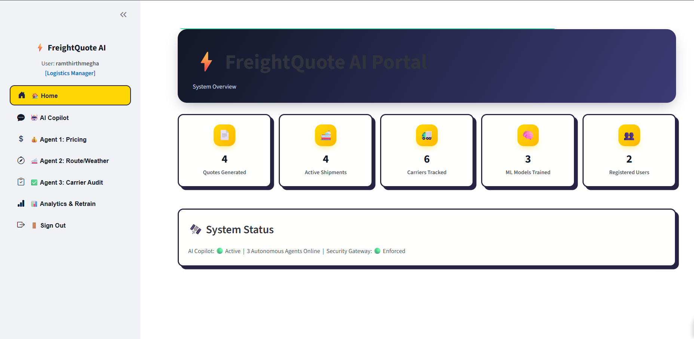
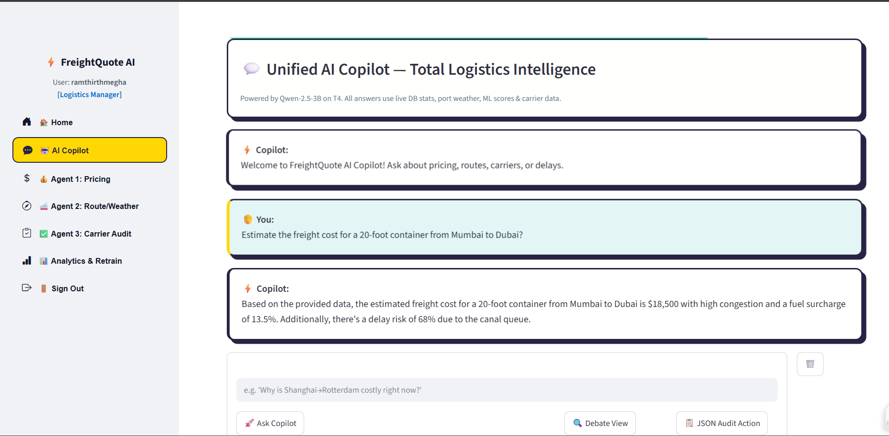
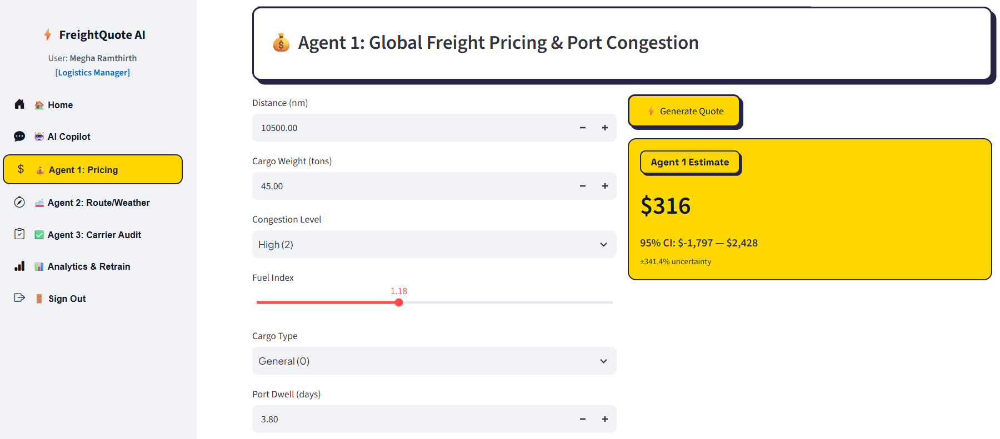
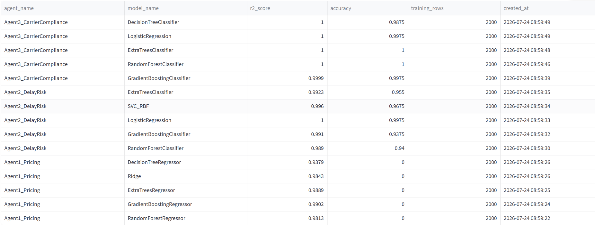
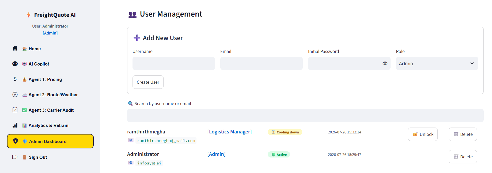
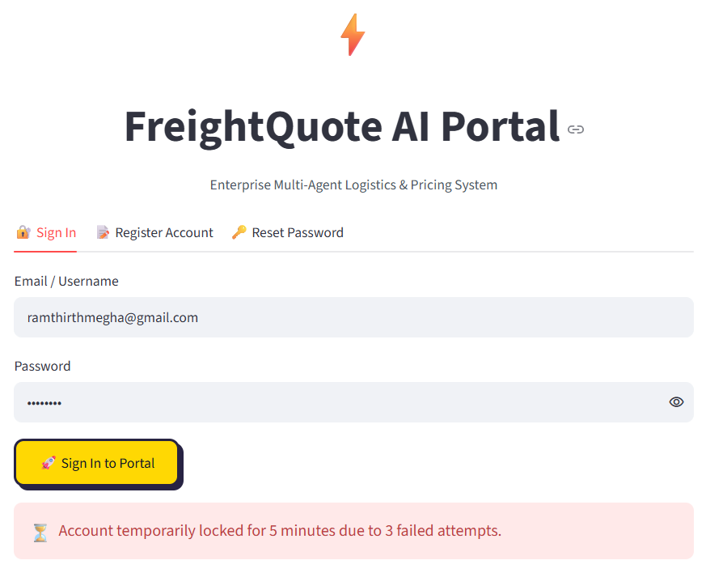
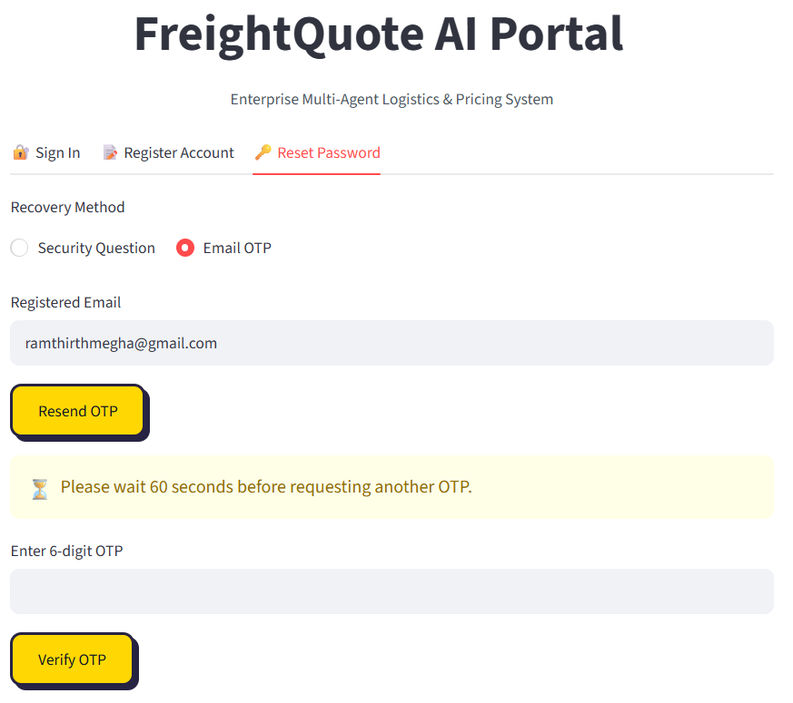

# Milestone 2 — FreightQuote AI Platform

**Full-Stack AI/ML Integration & Advanced Security Engine**

## What Milestone 2 Adds on Top of Milestone 1

Milestone 1 built the authentication gateway — Login, Signup, and Forgot Password with JWT
session handling. Milestone 2 keeps that same security gateway and unifies it with a
multi-agent ML core and a generative AI Copilot, while hardening the authentication layer
itself with three new security features: progressive account lockout, Gmail OTP resend rate
limiting, and a real-time password strength checker. It also adds a fully functional Admin
Dashboard with complete user lifecycle management (Add / Delete / Unlock).

## Features Built

- **Progressive Account Lockout** — 3 failed login attempts locks the account for 5 minutes,
  a 4th locks it for 15 minutes, and a 5th locks it permanently until an administrator
  unlocks it from the Admin Dashboard.
- **Forgot Password — Security Question or Email OTP** — two independent recovery routes;
  the OTP route sends a 6-digit code by Gmail with a resend cooldown (60s → 3min → 5min → 1hr).
- **Password Strength Checker** — real-time 🔴 Weak / 🟡 Average / 🟢 Good badge shown during
  registration and password reset; passwords under 5 characters are blocked outright.
- **Case-sensitive credentials** — passwords and security answers are matched exactly as
  typed, with no leading/trailing whitespace allowed, and a new password can never match
  the account's current password.
- **Optional Username at Signup** — only email and password are required; if no username is
  given, one is automatically derived from the email address.
- **Home Dashboard** — KPI overview (quotes generated, active shipments, carriers tracked,
  ML models trained, registered users) and live system status.
- **3 ML Agents, 5+ algorithms each** — Dynamic Pricing (regression), Route Delay Risk and
  Carrier Compliance (classification), each trained on real Kaggle logistics datasets with a
  synthetic-data fallback when Kaggle credentials aren't configured.
- **LLM Copilot (Qwen2.5-3B-Instruct, 4-bit)** — answers freight questions, offers a 3-agent
  "Debate View," and generates a structured JSON audit action synthesizing all 3 agents'
  outputs — with a rule-based fallback if the GPU/model isn't available.
- **Admin Dashboard** — visible only to accounts with `role = 'Admin'`; supports adding new
  users with any role, deleting users (with a confirmation step), unlocking locked accounts,
  and a live ML Model Card showing each agent's saved R²/RMSE/ROC-AUC metrics.

## System Architecture — 4 Phases

| Phase | Module / Component | Responsibility |
|---|---|---|
| **Phase 1: Security Gateway** | Authentication & JWT (`auth.py`, `db.py`) | Enforces Login, Registration, and Forgot Password (Gmail OTP) before unlocking the UI. Stores hashed credentials and progressive lockout state in SQLite. |
| **Phase 2: Domain Intelligence** | 3 Autonomous Agents (`train_ml_freight.py`, `agent2_freight.py`, `agent3_freight.py`) | Once authenticated, unlocks Agent 1: Dynamic Pricing, Agent 2: Route Delay Classifier, and Agent 3: Carrier Compliance Sentinel tabs. |
| **Phase 3: Generative Advisory** | LLM Copilot & JSON (`llm_engine_freight.py`) | Synthesizes the 3 agents' numerical outputs into executive shipping strategies and structured JSON audit actions using Qwen2.5-3B-Instruct. |
| **Phase 4: System Administration** | Admin Dashboard (`admin_dash.py`) | Dedicated administrative controls restricted exclusively to users authenticated with `role = 'Admin'`. |

## Indian Port Coverage

| Port | Location | Region |
|---|---|---|
| JNPT | Mumbai, Maharashtra | West Coast |
| Mundra | Gujarat | West Coast |
| Chennai | Tamil Nadu | East Coast |
| Cochin | Kerala | South-West Coast |

## Tech Stack

| Layer | Technology |
|---|---|
| UI / Frontend | Streamlit (shared `ui_theme.py` neo-brutalist theme) |
| Auth / Sessions | PyJWT + bcrypt |
| Database | SQLite |
| ML Agents | scikit-learn (5+ algorithms per agent), joblib |
| LLM Copilot | Qwen2.5-3B-Instruct (4-bit, bitsandbytes) via HuggingFace Transformers |
| Data source | Kaggle (`kagglehub`) with synthetic fallback |
| OTP delivery | Gmail SMTP |
| Public tunnel | ngrok |
| Runtime | Google Colab (T4 GPU) |

## How to Run

1. Open `FreightQuote_AI_Milestone2.ipynb` in Google Colab.
2. **Runtime → Change runtime type → T4 GPU → Save.**
3. Run the `!nvidia-smi` cell first to confirm the GPU is attached.
4. Set up Colab Secrets (see below), then run all cells top to bottom.
5. Open the printed ngrok URL, sign in, and explore.

## Setting Up Colab Secrets

Click the **key icon 🔑** in the left sidebar and add each of these, toggling **notebook access ON**:

| Secret Name | How to Get It | Used For |
|---|---|---|
| `JWT_SECRET_KEY` | Any long random string you make up | Signs & verifies login session tokens |
| `ADMIN_EMAIL_ID` | Any email you choose (defaults to `infosys@ai`) | Bootstraps the admin account |
| `ADMIN_PASSWORD` | 8+ chars, upper, lower, number, symbol (defaults to `admin@123`) | Bootstraps the admin account |
| `NGROK_AUTHTOKEN` | Free account at [ngrok.com](https://ngrok.com) → dashboard → copy Authtoken | Public HTTPS URL for the app |
| `HF_TOKEN` | [HuggingFace](https://huggingface.co) → Settings → Access Tokens | Authenticates Qwen2.5-3B (4-bit) inference |
| `EMAIL_ID` | The Gmail address that sends OTP emails | Sender address (optional — console fallback works without it) |
| `EMAIL_PASSWORD` | Gmail → 2-Step Verification → App Passwords → create one | Authenticates Gmail SMTP |
| `KAGGLE_USERNAME` / `KAGGLE_KEY` | From `kaggle.json` (see below) | Trains models on real Kaggle data instead of synthetic |

## Setting Up a Kaggle API Token (Recommended)

1. Log into [kaggle.com](https://kaggle.com) → profile picture → **Settings** → **API** section.
2. Click **Create New Token** — downloads a `kaggle.json` file containing a `username` and `key`.
3. Add those two values as the `KAGGLE_USERNAME` and `KAGGLE_KEY` Colab Secrets above.
4. Not required — the notebook trains on synthetic data automatically if these aren't set.

## Setting Up a Gmail App Password (for OTP emails)

1. Open the Gmail account's **Google Account settings**.
2. Turn on **2-Step Verification** first — App Passwords won't appear until it's enabled.
3. Search **"App Passwords"** in Account settings, create one, and label it (e.g. "FreightQuote AI").
4. Copy the 16-character password immediately — it can't be viewed again after closing.
5. Add it as `EMAIL_PASSWORD`, and the sending address as `EMAIL_ID`, in Colab Secrets.

## Screenshots

  <b>Home Page</b> 
   
  KPI overview — quotes generated, active shipments, carriers tracked, ML models trained, registered users.  

  <b>AI Copilot</b> 
   
  A freight question answered by the Qwen2.5-3B Copilot, synthesizing all 3 agents' data.  

  <b>ML Pricing Calculator</b> 
   
  Agent 1 predicting a freight cost from sample distance, weight, and congestion inputs.  

  <b>Admin Panel — ML Model Card</b> 
   
  R²/RMSE and ROC-AUC metrics for all 3 agents, pulled from the ml_models table.  

  <b>Admin Panel — Add / Delete / Unlock User</b> 
   
  Creating a new user, confirming a deletion, and unlocking a locked account.  

  <b>Triggered Account Lockout</b> 
   
  The temporary lockout message shown after 3 consecutive failed login attempts.  

  <b>OTP Resend Cooldown</b> 
   
  The rate-limiting message shown when requesting another OTP too soon.

