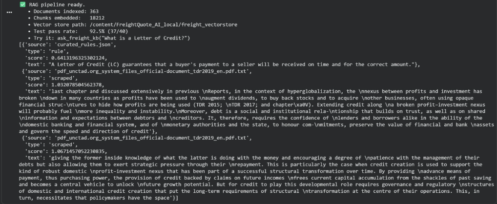
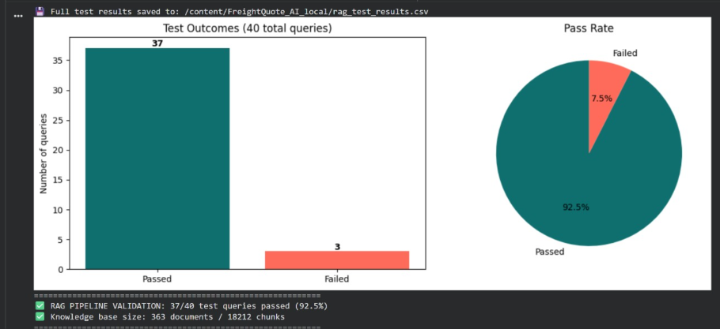
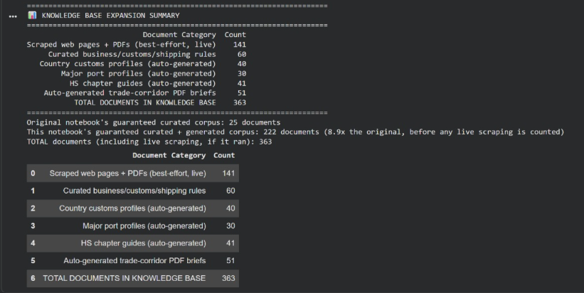

🚚 Intelligent Freight Quote Generation System (IFQGS)

Infosys Springboard Internship 7.0 – AI Internship Project

Domain: Artificial Intelligence | Machine Learning | Large Language Models | Retrieval-Augmented Generation (RAG)

📖 Project Overview

The Intelligent Freight Quote Generation System (IFQGS) is an AI-powered logistics assistant designed to simplify freight quotation, shipment analysis, and logistics decision-making through the integration of Machine Learning, Large Language Models (LLMs), and Retrieval-Augmented Generation (RAG).

The project was developed in three progressive milestones. The first milestone focuses on secure user authentication, the second milestone introduces AI-powered freight analysis with machine learning models and an intelligent LLM assistant, and the third milestone integrates a RAG pipeline that enables the system to answer logistics-related queries using information retrieved from a custom knowledge base instead of relying solely on the language model.

The system is deployed using Google Colab, Streamlit, and Ngrok, allowing users to securely access the application from any browser without requiring local installation.

✅ Milestone 1 Features
🔐 Secure User Authentication

Provides a complete Login, Signup, Forgot Password, and Logout system with secure session management using JWT tokens.

📧 Email OTP Verification

Verifies user identity by sending a One-Time Password (OTP) through Gmail SMTP during registration and password reset.

🔑 JWT Authentication

Uses JSON Web Tokens to securely manage authenticated sessions and protect user access.

🔒 Password Encryption

Stores passwords securely using BCrypt hashing instead of plain text.

❓ Security Questions

Allows users to reset passwords using predefined security questions as an additional authentication layer.

💾 SQLite Database

Stores user information, credentials, and authentication data locally using SQLite.

🌐 Streamlit Web Interface

Provides a clean and responsive user interface accessible directly from the browser.

🌍 Public Deployment using Ngrok

Exposes the Streamlit application running on Google Colab to the internet using Ngrok.

✅ Milestone 2 Features
🤖 AI Freight Quote Copilot

Integrates the Qwen 2.5 Large Language Model to assist users with logistics-related questions and freight quote generation.

📊 Machine Learning Price Prediction

Predicts freight pricing using multiple regression algorithms trained on logistics datasets.

🚛 Route Delay Prediction

Uses classification algorithms to estimate shipment delays and transportation risks.

✅ Carrier Compliance Analysis

Evaluates carrier reliability and compliance using machine learning models trained on logistics data.

📈 Multi-Model Comparison

Compares multiple ML algorithms and automatically selects the best-performing model based on evaluation metrics.

🔐 Advanced Security Engine

Implements progressive account lockout, OTP resend cooldown, password strength validation, and enhanced authentication.

👨‍💼 Administrator Dashboard

Allows administrators to manage users, unlock accounts, and monitor authentication activities.

⚡ Optimized LLM Loading

Uses 4-bit quantization and GPU acceleration to reduce memory usage and improve inference speed.

✅ Milestone 3 (RAG) Features
📚 Retrieval-Augmented Generation (RAG)

Enhances the LLM by retrieving relevant information from a custom logistics knowledge base before generating responses.

📄 PDF Knowledge Base

Indexes logistics manuals, freight documents, shipping guidelines, and company documents for intelligent retrieval.

🔎 Semantic Search

Uses sentence embeddings and vector similarity search to identify the most relevant document chunks.

🧠 Context-Aware Response Generation

Combines retrieved document context with the LLM to produce accurate, grounded, and relevant answers.

📦 FAISS Vector Database

Stores vector embeddings for efficient similarity search across large document collections.

📑 Automatic Document Chunking

Splits large PDF documents into smaller text chunks to improve retrieval accuracy.

💬 Intelligent Logistics Assistant

Answers logistics-related queries using both retrieved knowledge and the reasoning capabilities of the LLM.

🎯 Reduced Hallucinations

Minimizes incorrect or fabricated responses by grounding answers in trusted documents.

💻 Technologies Used
Category	Technologies
Programming Language	Python 3
Frontend	Streamlit
Backend	Python
Authentication	JWT, BCrypt
Database	SQLite
Machine Learning	Scikit-learn
Deep Learning	PyTorch
Large Language Model	Qwen2.5-3B-Instruct
RAG Framework	LangChain
Embedding Model	Sentence Transformers
Vector Database	FAISS
Document Processing	PyPDF2
Deployment	Google Colab
Public Access	Ngrok
Dataset Source	Kaggle
Model Repository	Hugging Face
Email Service	Gmail SMTP
Version Control	Git & GitHub
🧠 RAG Architecture
                    PDF Documents
                          │
                          ▼
                 Document Loader
                          │
                          ▼
                  Text Chunking
                          │
                          ▼
              Sentence Embeddings
                          │
                          ▼
               FAISS Vector Store
                          │
          User Query ─────┘
                 │
                 ▼
          Similarity Search
                 │
                 ▼
        Relevant Context Retrieved
                 │
                 ▼
      Qwen 2.5 Large Language Model
                 │
                 ▼
          Intelligent Final Response
Explanation
Logistics PDF documents are uploaded into the system.
Documents are divided into smaller chunks.
Sentence embeddings are generated for each chunk.
Embeddings are stored inside a FAISS vector database.
User queries are converted into embeddings.
FAISS retrieves the most relevant document chunks.
Retrieved context is combined with the user query.
The Qwen LLM generates an accurate, context-aware response.
📂 Project Structure
IFQGS/
│
├── Milestone1/
│   ├── app.py
│   ├── auth.py
│   ├── database.py
│   ├── utils.py
│   ├── config.py
│   ├── requirements.txt
│   └── README.md
│
├── Milestone2/
│   ├── app.py
│   ├── llm_engine.py
│   ├── ml_models.py
│   ├── admin.py
│   ├── config.py
│   ├── requirements.txt
│   └── README.md
│
├── Milestone3/
│   ├── rag_pipeline.py
│   ├── document_loader.py
│   ├── embeddings.py
│   ├── vector_store.py
│   ├── query_engine.py
│   ├── knowledge_base/
│   ├── requirements.txt
│   └── README.md
│
├── screenshots/
├── README.md
└── requirements.txt
🔑 Google Colab Secrets

Create the following secrets inside Google Colab → Secrets.

Secret Name	Description
NGROK_AUTHTOKEN	Ngrok authentication token
HF_TOKEN	Hugging Face access token
EMAIL_ADDRESS	Gmail address
EMAIL_PASSWORD	Gmail App Password
JWT_SECRET	Secret key for JWT authentication
KAGGLE_USERNAME	Kaggle username
KAGGLE_KEY	Kaggle API key
🌐 Ngrok Setup (5 Steps)
Create an account on the Ngrok website.
Verify your email address.
Copy your Ngrok Authtoken from the dashboard.
Save the token as NGROK_AUTHTOKEN in Google Colab Secrets.
Start Ngrok in the notebook to obtain the public Streamlit URL.
📊 Kaggle API Setup (5 Steps)
Create or log in to your Kaggle account.
Open Account Settings.
Click Create New API Token.
Download the kaggle.json file.
Save the username and API key in Google Colab Secrets.
🤗 Hugging Face Token Setup (5 Steps)
Create a Hugging Face account.
Open Settings → Access Tokens.
Create a new Read access token.
Copy the generated token.
Store it as HF_TOKEN in Google Colab Secrets.
📧 Gmail App Password Setup (5 Steps)
Enable Two-Factor Authentication for your Google account.
Open Google Account → Security.
Select App Passwords.
Generate a password for Mail.
Save the generated 16-character password as EMAIL_PASSWORD in Google Colab Secrets.
▶️ How to Run the Project
Step 1

Clone the repository.

git clone <repository-url>
Step 2

Open the project notebook in Google Colab.

Step 3

Add all required secrets to Google Colab.

Step 4

Install the required Python libraries.

pip install -r requirements.txt
Step 5

Run all notebook cells sequentially.

Step 6

Authenticate Ngrok to expose the Streamlit application.

Step 7

Launch the Streamlit application.

Step 8

Open the generated Ngrok URL in your browser and start using the Intelligent Freight Quote Generation System.

📷 Screenshots

  <b>RAG_pipeline</b> 
   
  Expanded the RAG knowledge base from 25 curated documents to 363 total documents using web scraping and auto-generated logistics resources.
Included shipping rules, customs profiles, port information, HS code guides, and trade-corridor documents to improve retrieval quality.  

  <b>RAG_pipeline_validation</b> 
   
  Scraped 98 logistics-related web pages and automatically discovered and processed 139 PDF documents.
Successfully extracted and stored 141 text documents, creating a rich dataset for the RAG pipeline.  

  <b>knowledge_base_summary</b> 
   
  Indexed 363 documents into a vector database, generating 18,212 text chunks for semantic search.
Achieved a 92.5% retrieval accuracy and enabled natural-language question answering on freight and logistics topics.  

  <b>web_scraping</b> 
   
  Evaluated the system using 40 test queries, with 37 successful responses and only 3 failures.
The final RAG system achieved a 92.5% pass rate, demonstrating reliable document retrieval and response generation.

